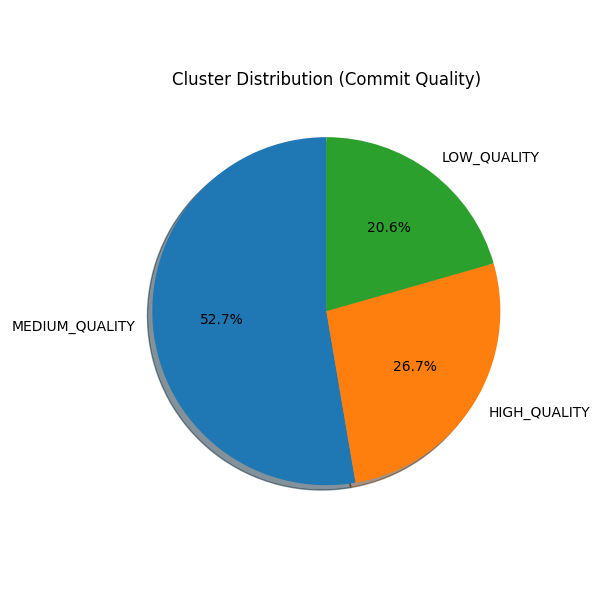
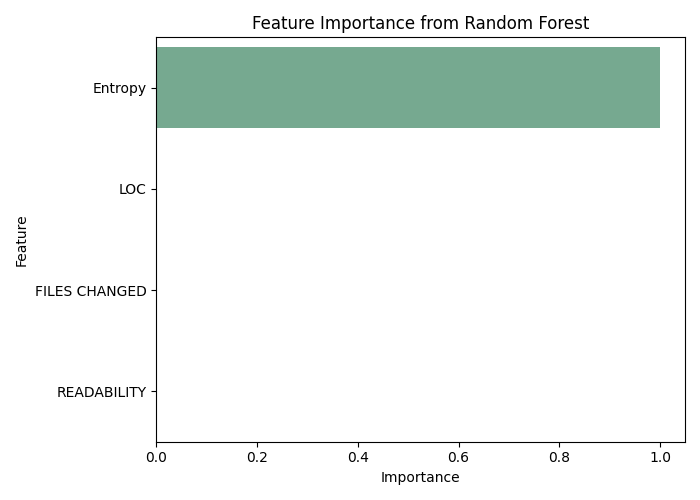
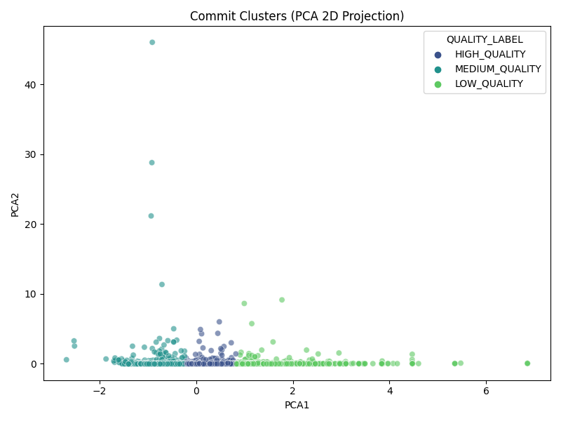
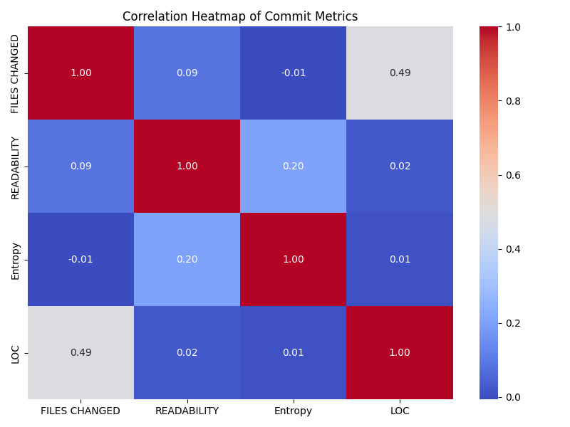

# Machine Learning-Based GitHub Commit Quality Classification System

Classifying GitHub commits into **Low / Medium / High** quality using **unsupervised machine learning**

## Overview

Modern software teams process thousands of Git commits daily. However, not all commits are equally valuable — some are clear and meaningful, while others lack clarity or context.

This project uses **unsupervised learning (Custom K-Medoids)** to automatically classify commits based on **message clarity** and **code change characteristics**. The model demonstrates that **readability** and **entropy** strongly correlate with commit quality, enabling automated prioritization for code review.

## 🎯 Objective

Automatically classify GitHub commits into **Low**, **Medium**, and **High** quality categories using K-Medoids clustering and validate quality separation using Random Forest regression.

## 📂 Dataset

Commit history collected from 6 major open-source repositories, totaling **300,000+ commits**:

- WordPress
- CDT
- Tomcat
- PHP
- MySQL
- GnuCash

Each commit includes metadata such as message, files changed, lines inserted, and lines deleted.

## 🧰 Tech Stack

| Category       | Tools                                      |
|----------------|--------------------------------------------|
| Processing     | Python, Pandas, NumPy                      |
| ML             | Scikit-Learn, RandomForestRegressor        |
| Clustering     | Custom K-Medoids (implemented manually)    |
| Math / NLP     | Shannon Entropy, Readability (Flesch-Kincaid) |
| Visualization  | Seaborn, Matplotlib                        |
| Export         | Excel / XlsxWriter                         |

## 🧠 Features Used

| Feature            | Description                                 |
|--------------------|---------------------------------------------|
| Entropy            | Information richness of commit message      |
| Readability        | Flesch-Kincaid readability score            |
| LOC                | Insertions + deletions                      |
| Files Changed      | Breadth of modification                     |
| Message Length     | Size / detail of message                    |

## 🔄 Workflow

1. Extract commit logs from GitHub → `dataset.xlsx`
2. Clean dataset & compute Entropy / Readability / LOC / Length
3. Normalize features for clustering
4. Apply custom K-Medoids clustering (**k = 3**)
5. Validate clusters using Random Forest regression
6. Visualize results & produce insights
7. Document findings in research format

## ⚙ Performance & Scalability Considerations

The full dataset contains ~300,000 commits, but K-Medoids has **O(n²)** complexity.

| Rows Clustered | Approx Runtime     | Purpose                     |
|----------------|--------------------|-----------------------------|
| 5k             | 1–2 min            | Quick testing               |
| 20k            | 10–20 min          | Experiment results (used)   |
| 50k            | 45–60 min          | Extended evaluation         |
| 300k           | Many hours         | Requires optimized impl.    |

**Sampling** (20k commits) maintains realistic distribution and preserves statistical behavior.

### Future Optimization Ideas
- Use `sklearn-extra` optimized K-Medoids
- Distributed clustering via Spark or Dask
- Alternative scalable algorithms (HDBSCAN, MiniBatch-KMeans)

## 📊 Results & Insights

### 📍 Cluster Distribution

### 🧠 Feature Importance (Random Forest)
| Feature          | Importance |
|------------------|------------|
| Readability      | Highest    |
| Entropy          | Strong     |
| LOC              | Moderate   |
| Message Length   | Moderate   |
| Files Changed    | Lowest     |

### 🔥 PCA 2D Cluster Visualization

### 📈 Correlation Heatmap

### 🧠 Key Insights

| Insight                                 | Interpretation                                                                 |
|-----------------------------------------|--------------------------------------------------------------------------------|
| High-quality commits                    | High readability & entropy                                                     |
| File count                              | Weak indicator — number of files updated does not determine quality           |
| Low-quality commits                     | Short, low-information messages are common                                     |
| Model validation                        | Random Forest metrics significantly improve on clusters 2 & 3                 |

## 🚀 Real-World Applications

- Automated commit scoring in CI/CD
- Code review prioritization
- Developer analytics dashboards
- Engineering productivity metrics

## 🔮 Future Enhancements

- Use NLP embeddings (BERT, CodeBERT) for message semantics
- Add code diff complexity features (cyclomatic complexity, AST analysis)
- Deploy interactive dashboard (Streamlit / Flask)
- Integrate into CI pipelines for real-time quality scoring

## 🙏 Acknowledgements

Inspired by academic research on unsupervised clustering of open-source software quality, extended to the commit level.
